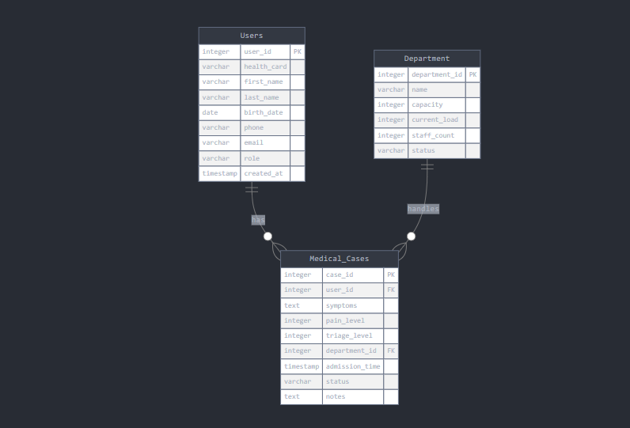

# Hospital Triage Database Design Documentation

## Entities Description

### Users
This entity maintains records of all system users, including both patients and medical staff, storing essential identification and access information.

### Medical_Cases
This entity tracks individual medical incidents, including symptoms, severity assessment, and treatment status. It serves as the core record for the triage process.

### Department
This entity manages different hospital areas and their specific resources, helping optimize patient distribution and care delivery.

## Attributes Specification

### Users Attributes:
- `user_id` (integer): PRIMARY KEY, unique identifier for each user
- `health_card` (varchar): Unique health card number for patient identification
- `first_name` (varchar): User's first name
- `last_name` (varchar): User's last name
- `birth_date` (date): User's date of birth
- `phone` (varchar): Contact phone number
- `email` (varchar): Contact email address
- `role` (varchar): Identifies user type (patient, doctor, nurse, admin)
- `created_at` (timestamp): Account creation timestamp

### Medical_Cases Attributes:
- `case_id` (integer): PRIMARY KEY, unique identifier for each case
- `user_id` (integer): FOREIGN KEY referencing Users table
- `symptoms` (text): Description of patient's symptoms
- `pain_level` (integer): Pain scale rating from 1-10
- `triage_level` (integer): Emergency severity (1-5, where 1 is most urgent)
- `department_id` (integer): FOREIGN KEY referencing Department table
- `admission_time` (timestamp): When the case was created
- `status` (varchar): Current state (waiting, in_treatment, discharged)
- `notes` (text): Additional medical observations

### Department Attributes:
- `department_id` (integer): PRIMARY KEY, unique identifier for each department
- `name` (varchar): Department name (ER, ICU, General, etc.)
- `capacity` (integer): Maximum number of patients
- `current_load` (integer): Current number of patients
- `staff_count` (integer): Number of medical staff assigned
- `status` (varchar): Operating status (active, full, maintenance)

## Database ERD (Entity-Relationship Diagram)

The ERD visualizes how Medical_Cases acts as a bridge between Users and Departments, with each case associated with one user and assigned to one department. This structure enables efficient patient tracking and resource management throughout the triage process.

## Relationships

1. Users to Medical_Cases: One-to-Many
   - One user can have multiple medical cases
   - Each medical case belongs to exactly one user

2. Department to Medical_Cases: One-to-Many
   - One department can handle multiple medical cases
   - Each medical case is assigned to one department

## Constraints

- Triage_level must be between 1 and 5
- Pain_level must be between 1 and 10
- Department capacity must be greater than current_load
- User role must be one of: 'patient', 'doctor', 'nurse', 'admin'
- Case status must be one of: 'waiting', 'in_treatment', 'discharged'